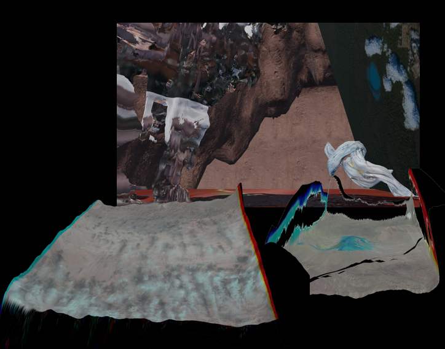

# [Pas Normales Landscapes](https://nika-akin.github.io/wrong-biennale/)



**Pas Normales Landscapes**  is an interactive 3D space. [Enter here](https://nika-akin.github.io/wrong-biennale/)
---

## Concept
Pas Normales Landscapes explores how meaning is constructed through technological mediation. 
This aligns with the theory of predictive coding (Friston, 2010), which posits that the brain constructs reality by generating predictions from incomplete sensory input. The AI-generated landscapes in Pas Normales Landscapes are not direct representations of the Earth, but virtual constructs—assemblages of possibility, shaped by both the limitations and creative capacities of machine learning algorithms.
The project thus serves as a model for studying how both humans and machines generate coherent environments from fragmented data. 
It investigates how reality is constructed—by both minds and machines—through processes of translation, inference, and creative synthesis. 


This project was submitted for the **Wrong Biennale** and investigates the intersection of satellite imagery, deep learning, and cognitive science:

- The scene contains **electron orbital clouds** (s, p, d orbitals) that can be explored interactively.  
- Each orbital represents the **probabilistic densities** of electrons, serving as a **metaphor for the ambiguity of knowledge and measurements**.  
- The 3D landscape itself is generated from **satellite images sampled from 1970–2025** using the Earth Explorer database.  
- Depth inference and mesh generation were performed using **deep learning models**:
  - **ZoeDepth Zero-Shot** for metric depth estimation from a single image.
  - **Hunyuan3D-DIT-v2** in **ComfyUI** for single-image to 3D voxel inference.
  - **KSampler: Karras, Euler, CFG 8.0** to reconstruct a 3D mesh surface.

---

## Navigation

- Click the scene to enter **FPS controls** (desktop) or use **touch gestures** (mobile).  
- **Desktop Controls**:
  - `W` / `S` : Move forward / backward  
  - `A` / `D` : Move left / right  
  - `Space` : Move up  
  - `Shift` : Move down  
  - Mouse movement controls the camera orientation
- **Mobile Controls**:
  - Use touch drag to rotate camera  
  - Pinch to zoom in/out  
  - Pan gestures to move across the landscape

> **Audio-reactive elements**: Once the audio starts, the orbitals and landscape respond to tempo and pitch, creating a dynamic representation of quantum ambiguity in motion.

---

## Technical Details

- **3D Engine**: [Three.js](https://threejs.org/)  
- **Models**: GLTF format for astronaut and satellite meshes  
- **Audio**: Ambient sound used to drive orbital animations  
- **Shaders**: Custom shaders for:
  - Electron clouds
  - Wave surfaces
- **Interactive Orbitals**: Electron positions are generated procedurally based on s, p, d orbital shapes.

---

## Installation / Usage

1. Clone this repository:
   ```bash
   git clone https://github.com/nika-akin/wrong-biennale.git

